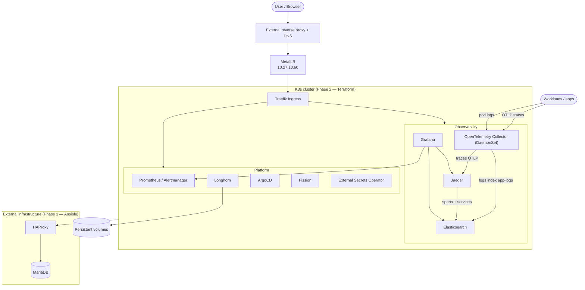

# k3s-cluster

Two-phase homelab K3s platform on Proxmox: Ansible bootstraps the cluster (external HAProxy + MariaDB + K3s), Terraform deploys platform services for ingress, storage, observability, tracing, and GitOps.

This repository is designed as a reproducible platform engineering lab: bootstrap the cluster, layer in core services, and operate it like a small self-hosted platform.

## Overview

This project provisions and configures a K3s-based Kubernetes environment using a **two-phase deployment model**:

**Phase 1 — Bootstrap (Ansible, SSH):**
- External **HAProxy + MariaDB** infrastructure on LXC container
- **K3s** control plane and worker nodes on Ubuntu VMs
- Kubeconfig fetch to control node

**Phase 2 — Services (Terraform, kubeconfig):**
- Core platform services deployed via Terraform modules
- Ingress, storage, observability, tracing, GitOps, FaaS, secrets management

**Fresh install vs existing cluster:**
- **Fresh install:** Run Phase 1 (Ansible bootstrap) then Phase 2 (Terraform services)
- **Existing cluster:** Skip Phase 1, run Phase 2 only (Terraform)

The current setup uses:

- **Ansible** for infrastructure bootstrap (Phase 1).
- **Terraform** for service deployment (Phase 2, primary path).
- **K3s** as the Kubernetes distribution.
- **Traefik** for ingress.
- **MetalLB** for load balancing in the homelab network.
- **Longhorn** for distributed storage.
- **Prometheus** for monitoring.
- **Elasticsearch** for log and trace storage.
- **Jaeger** for distributed tracing.
- **OpenTelemetry Collector** for telemetry pipeline.
- **Grafana** for unified observability dashboards.
- **ArgoCD** for GitOps-driven delivery.
- **Fission** for FaaS.
- **External Secrets Operator** for secrets management.

## Architecture

At a high level, the cluster is composed of:

- One **LXC container** hosting external infrastructure services.
- Multiple **Ubuntu VMs** acting as K3s nodes.
- A control node running Ansible, Terraform, Helm, and kubectl.



Phase 1 = Ansible bootstrap (HAProxy + MariaDB on LXC, K3s nodes); Phase 2 = Terraform services; observability pipeline = apps → OTel Collector → {Jaeger→ES (traces), ES (logs)} → Grafana (+ Prometheus).

This separation keeps the datastore and load balancer outside the cluster while letting K3s focus on workload orchestration. Terraform manages services declaratively via Helm and Kubernetes providers.

## Prerequisites

### Control node

Your local machine or CI runner should have:

- `ansible-core >= 2.15`
- `terraform >= 1.5`
- `helm`
- `kubectl`
- Access to the required Ansible collections:

```bash
ansible-galaxy collection install community.docker
```

Your kubeconfig should point to the K3s cluster once it has been fetched.

### Infrastructure

The current documented environment expects:

- One Ubuntu-based **LXC container** with root SSH access.
- Ubuntu **VM nodes** with SSH access and passwordless sudo.

Adjust inventory and variables if your homelab layout changes.

## Setup

Create local configuration files before running deployment.

### Ansible configuration (Phase 1)

```bash
cp ansible/inventory/homelab/vars/local.yml.example ansible/inventory/homelab/vars/local.yml
cp ansible/inventory/homelab/hosts.ini.example ansible/inventory/homelab/hosts.ini  
cp ansible/inventory/homelab/host_vars/docker-host.yml.example ansible/inventory/homelab/host_vars/docker-host.yml
```

Edit `local.yml` and set values such as:

- `vm_username`
- `ansible_become_password`

Then edit `hosts.ini` and set values such as:

- `ansible_host`

for `docker_host`, `masters` and `workers`

Finally edit `docker-host.yml` and set values as:

- `ansible_user`
- `docker_users`
- `docker_host_ip`

### Terraform configuration (Phase 2)

```bash
cp terraform/terraform_example.tfvars terraform/terraform.tfvars
```

Edit `terraform.tfvars` with your values:

- `domain`, `metallb_ip_pool_range`
- domains: `traefik_dashboard_domain`, `longhorn_domain`, `prometheus_domain`, `alertmanager_domain`, `jaeger_domain`, `grafana_domain`, `argocd_domain`, `fission_domain`
- secrets: `traefik_dashboard_password`, `grafana_admin_password`
- `eso_aws_*` (optional — see External Secrets Operator section)

Detailed configuration reference: [`CONFIGURATION.md`](./CONFIGURATION.md)

## Deployment order

The cluster is installed in two phases. **Phase 1** (Ansible bootstrap) runs over SSH for infrastructure setup. **Phase 2** (Terraform services) runs against the cluster through kubeconfig.

### Phase 1 — Bootstrap (Ansible, SSH)

**Optional for existing cluster:** If K3s is already running and kubeconfig is present, skip to Phase 2.

| Step | Playbook | Purpose | Auth |
|---|---|---|---|
| 1 | `playbooks/01-infra.yml` | Deploy HAProxy and MariaDB on Docker in the LXC host | Root SSH |
| 2 | `playbooks/02-k3s.yml` | Install K3s on master and worker nodes | SSH + sudo |
| 3 | `playbooks/03-kubeconfig.yml` | Fetch kubeconfig to the control node (`~/.kube/config`) | SSH + sudo |
| 4 | `playbooks/04-node-prereqs.yml` | Install Longhorn prerequisites (open-iscsi, nfs-common, kernel modules) on all nodes | SSH + sudo |

**Note:** Step 3 is needed only when local kubeconfig is absent. Terraform `providers.tf` uses default `~/.kube/config` for helm+kubernetes providers.

**Note:** Step 4 installs Longhorn prerequisites (open-iscsi, nfs-common, kernel modules) required for Longhorn storage operator in Phase 2. Without this, longhorn-manager fails with `nsenter: failed to execute iscsiadm: No such file or directory`.

Run from `ansible/` directory:

```bash
# Step 1: Deploy HAProxy + MariaDB on LXC
ansible-playbook playbooks/01-infra.yml

# Step 2: Install K3s on masters + workers
ansible-playbook playbooks/02-k3s.yml

# Step 3: Fetch kubeconfig to control node (optional if kubeconfig already present)
ansible-playbook playbooks/03-kubeconfig.yml

# Step 4: Install Longhorn prerequisites on all nodes (required for Phase 2 Longhorn PVCs)
ansible-playbook playbooks/04-node-prereqs.yml
```

If you are not using values from `local.yml`, add `--ask-become-pass` where needed.

### Phase 2 — Services (Terraform, kubeconfig)

Terraform deploys 12 modules:

| Module | Purpose |
|---|---|
| `traefik` | Ingress controller |
| `metallb` | Load balancer |
| `longhorn` | Distributed storage |
| `prometheus` | Monitoring |
| `elasticsearch` | Log and trace storage |
| `jaeger` | Distributed tracing |
| `otel` | OpenTelemetry Collector |
| `grafana` | Unified observability dashboards |
| `argocd` | GitOps |
| `external-db` | External database Services/EndpointSlices |
| `fission` | FaaS |
| `external-secrets` | External Secrets Operator + AWS provider |

**Two-pass apply (required):**

Phase 2 uses a two-pass deployment to handle CRD dependencies. Helm charts (Traefik, kube-prometheus-stack, external-secrets, metallb, Fission) install their own CRDs as part of the release; Fission CRDs are also applied via a `local-exec`. However, Terraform's `kubernetes_manifest` resource resolves each manifest's GVK at **plan time**, so any `kubernetes_manifest` that depends on those CRDs (Middleware, IPAddressPool, L2Advertisement, ServiceMonitor, ClusterSecretStore, Fission CRs) cannot be planned until the CRDs exist. Pass 1 installs the Helm releases (which bring their CRDs) plus core ingresses/secrets, with CRD-dependent `kubernetes_manifest` resources gated off. Pass 2 enables those manifests now that the CRDs are present.

**Fresh cluster — order matters:**

On a fresh cluster (no CRDs installed yet), you **must** run `make bootstrap` (pass 1) **before** `make plan` or `make apply`. Both `make plan` and `make apply` set `enable_crd_manifests=true` and expect CRDs to already exist — running them before pass 1 will fail with `API did not recognize GroupVersionKind` errors.

Run from `terraform/` directory:

```bash
# Initialize Terraform
terraform init

# Validate configuration
terraform validate

# Pass 1 (REQUIRED FIRST on fresh cluster): install all Helm releases (which bring their CRDs) + core ingresses/secrets; CRD-dependent manifests gated off
make bootstrap

# Preview pass 2 (CRD manifests) — only valid AFTER make bootstrap
make plan

# Pass 2: enable CRDs and apply remaining resources (Middleware, IPAddressPool, ServiceMonitor, ClusterSecretStore, Fission CRs)
make apply
```

**Preview pass 1 before applying?** Use `make plan-bootstrap` (sets `enable_crd_manifests=false`). Do **not** use `make plan` to preview pass 1 on a fresh cluster — it will fail because CRDs are not yet installed.

**Why two passes?** `kubernetes_manifest` resolves each manifest's GVK at plan time — before CRDs exist, plan fails with `API did not recognize GroupVersionKind`. `make bootstrap` sets `enable_crd_manifests=false`, which gates OFF our CRD-dependent `kubernetes_manifest` resources (Middleware, IPAddressPool, L2Advertisement, ServiceMonitor, ClusterSecretStore, Fission CRs) while still installing the Helm releases themselves — and those charts install their own CRDs (traefik.io, monitoring.coreos.com, external-secrets.io, metallb.io, plus Fission CRDs via local-exec). `make apply` sets `enable_crd_manifests=true`, enabling the CRD-dependent manifests now that the CRDs exist. Running `make bootstrap` alone after a full apply will remove pass-2 resources — always use `make apply` for subsequent runs.

## Operating an existing cluster

Once the cluster is fully deployed (Phase 1 done, Phase 2 applied at least once), day-to-day changes use the normal Terraform flow. **Do not re-run Phase 1 (Ansible bootstrap)** unless you are rebuilding the cluster from scratch.

### Routine plan/apply

```bash
# Only needed if you added/changed a module or Terraform variable
terraform init

make plan
make apply
```

Both `make plan` and `make apply` set `enable_crd_manifests=true`. CRDs already exist on an applied cluster, so this is the correct and only flow.

**Warning:** Never run `make bootstrap` alone on a fully-applied cluster. `make bootstrap` sets `enable_crd_manifests=false`, which will **destroy** the pass-2 resources (Middleware, IPAddressPool, L2Advertisement, ServiceMonitor, ClusterSecretStore, Fission CRs). The two-pass flow (`make bootstrap` → `make apply`) is for **fresh clusters only**.

### Adding a new service (module)

1. Create `terraform/modules/<svc>/` with `main.tf`, `variables.tf`, `outputs.tf`, and a `files/` directory for values — follow the pattern of an existing module.
2. Wire it up:
   - Add a `module "<svc>" { ... }` block (with appropriate `depends_on`) in `terraform/main.tf`.
   - Declare its variables in `terraform/variables.tf`.
   - Add example values in `terraform/terraform_example.tfvars` (and your private `terraform/terraform.tfvars`).
   - Add any useful outputs in `terraform/outputs.tf`.
3. Initialize and apply:
   ```bash
   terraform init   # new module
   make plan
   make apply
   ```
4. If the service has host prerequisites (storage packages, kernel modules, sysctls), extend `ansible/playbooks/04-node-prereqs.yml` and run it against the nodes.
5. Update this README and [`CONFIGURATION.md`](./CONFIGURATION.md) to document the new module and its variables.

### Changing a service

Edit the relevant `terraform/modules/<svc>/files/*-values.yaml` (and any variables in `terraform/variables.tf` / `terraform/terraform.tfvars`), then:

```bash
make plan
make apply
```

### Removing a service

1. Remove the `module "<svc>" { ... }` block from `terraform/main.tf`.
2. Remove its variables from `terraform/variables.tf`, `terraform/terraform.tfvars`, and `terraform/terraform_example.tfvars`.
3. Remove its outputs from `terraform/outputs.tf`.
4. Delete the `terraform/modules/<svc>/` directory.
5. Run:
   ```bash
   make plan    # confirm only that service's resources are being destroyed
   make apply
   ```

### Note

Changing a fresh cluster later is normal `make plan` / `make apply`. The two-pass bootstrap flow is not re-run after the initial deploy.

## Verify

After Phase 2 completes, verify cluster state:

```bash
# Check nodes
kubectl get nodes

# Check all pods
kubectl get pods -A

# Check ingress
kubectl get ingress -A
```

Access UIs (replace `<domain>` with your configured domain):

- Grafana: `https://grafana.<domain>`
- Jaeger: `https://jaeger.<domain>`
- Traefik Dashboard: `https://traefik.<domain>`
- ArgoCD: `https://argocd.<domain>`

## Troubleshooting / failure scenarios

Common failures, symptoms, and fixes.

### `helm_release` "could not download chart ... not found"

**Symptom:** `terraform apply` fails with chart-not-found errors.

**Fix:** When `repository` is set, `chart` must be the chart name only (e.g. `"traefik"`, not `"traefik/traefik"`). Also check `terraform.tfvars` — if you have stale `*_chart` or `*_version` overrides, delete them. Defaults in `variables.tf` are correct.

### `Kubernetes cluster unreachable: no configuration`

**Symptom:** Helm or Kubernetes provider cannot connect.

**Fix:** Ensure `providers.tf` has `kubernetes { config_path = "~/.kube/config" }` and `helm { kubernetes { config_path = "~/.kube/config" } }`. Run `03-kubeconfig.yml` to fetch kubeconfig if missing.

### `API did not recognize GroupVersionKind ... CRD may not be installed`

**Symptom:** Resources referencing Fission or ESO CRDs fail to apply.

**Fix:**

- **Fresh cluster (first deploy):** Run `make bootstrap` first (pass 1 installs Helm releases + CRDs). `make plan` / `make apply` before pass 1 is **expected to fail** — they set `enable_crd_manifests=true` and need CRDs present. To preview pass 1, use `make plan-bootstrap`.
- **After a prior full apply:** Use the two-pass flow: `make bootstrap` (CRD-dependent manifests gated off; Helm charts still install their own CRDs) then `make apply` (CRD-dependent manifests enabled). Do NOT run `make bootstrap` alone after a full apply — it removes pass-2 resources.

### Helm `context deadline exceeded`

**Symptom:** `terraform apply` times out waiting for release readiness.

**Fix:** Releases use `wait=false` — helm does not block on pod readiness. Check pods directly with `kubectl get pods -n <namespace>`. Do not confuse helm wait timeout with actual readiness.

### Traefik Service `EXTERNAL-IP <pending>`

**Symptom:** Traefik LoadBalancer Service stuck pending.

**Fix:** Normal until pass 2 creates the MetalLB `IPAddressPool`. After `make apply`, MetalLB assigns the IP automatically.

### Longhorn `longhorn-manager` fatal `iscsiadm: No such file or directory` / PVCs stuck Pending

**Symptom:** longhorn-manager pods crash with iscsiadm errors. PVCs remain Pending.

**Fix:** Run `04-node-prereqs.yml` (installs open-iscsi, nfs-common, kernel modules), then restart the daemonset:

```bash
kubectl -n longhorn-system rollout restart ds/longhorn-manager
```

### Elasticsearch `0/1` readiness `ELASTIC_PASSWORD variable is missing`

**Symptom:** Elasticsearch pod fails readiness check.

**Fix:** Values already set a dummy env var for security-off mode. If you changed values, keep security disabled and preserve the probe workaround in the helm values.

### Jaeger `CrashLoopBackOff` `connection refused 9200`

**Symptom:** Jaeger pod crashes trying to connect to Elasticsearch.

**Fix:** Elasticsearch not Ready yet. Wait for ES pod to become Ready (`kubectl get pods -n elasticsearch`), then Jaeger recovers automatically. Or delete the Jaeger pod to force restart.

### Traces not in Jaeger

**Symptom:** Jaeger UI shows no traces.

**Fix:** OTel collector Service must be enabled. In daemonset mode, ensure `service.enabled: true` in the OTel collector values.

### Logs not in Grafana/ES `400 illegal_argument_exception`

**Symptom:** Grafana logs panel shows Elasticsearch errors.

**Fix:** Exporter mapping mode must be `raw` (use transform processor to restructure logs before sending to ES).

### Reset/cleanup a botched Phase 2

**Symptom:** Terraform state inconsistent, resources half-deployed.

**Fix:** Uninstall individual releases and remove from state:

```bash
helm uninstall <release> -n <namespace>
terraform state rm <module.resource>
```

Then re-apply. For a full reset on a fresh-ish cluster: `terraform destroy` then re-run Phase 2.

### `terraform plan` not idempotent / secret churn

**Symptom:** Traefik dashboard password secret shows changes on every plan.

**Fix:** The password resource uses `ignore_changes` lifecycle rule to prevent churn. To rotate the password, edit the Kubernetes secret manually — do not change it in `terraform.tfvars`.

## External Secrets Operator

The Terraform module `external-secrets` installs the External Secrets Operator (ESO, chart `external-secrets/external-secrets`, namespace `external-secrets`) and exposes the **AWS provider connection only** — a credentials Secret `eso-aws-creds` plus one `ClusterSecretStore` per `eso_aws_cluster_stores` entry. This repo does **not** create consumer namespaces, `ExternalSecret`s, or demo resources; those belong in the consuming service repos.

Configuration lives in `terraform/terraform.tfvars` (gitignored — never commit credentials); the full schema is documented in [`CONFIGURATION.md`](./CONFIGURATION.md). The main keys:

- `eso_aws_emulator_endpoint` — mode switch. **Empty** (default) → real AWS Secrets Manager defaults. **Set to a URL** → emulator mode (base URL must be reachable from the cluster).
- `eso_install_crds` — whether to install ESO CRDs (default `true`).
- `eso_aws_access_key_id` / `eso_aws_secret_access_key` — static AWS credentials used against the emulator.
- `eso_aws_cluster_stores` — list of `{name, region, service}` objects; one `ClusterSecretStore` (AWS SecretsManager) per entry. A creds Secret `eso-aws-creds` is created in the `external-secrets` namespace and referenced from every store's `auth.secretRef`. Empty list → operator-only install (no provider connection).

When the emulator is in use (endpoint set), the ESO controller pod gets `AWS_SECRETSMANAGER_ENDPOINT` pointing at it, so all configured stores use the same emulator. No emulator is deployed by this repo — it runs out of cluster.

**Boundary:** consuming service repos own their Namespace and the `ExternalSecret` that references one of the stores above. Reference the cluster-wide store and follow the remote key convention `<svc>/<env>/<name>` with a JSON blob payload:

```yaml
apiVersion: external-secrets.io/v1
kind: ExternalSecret
metadata:
  name: <es-name>
  namespace: <service-namespace>
spec:
  refreshInterval: 1h
  secretStoreRef:
    kind: ClusterSecretStore
    name: eso-aws            # = eso_aws_cluster_stores entry name
  target:
    name: <target-secret>
    creationPolicy: Owner
  dataFrom:
    - extract:
        key: <svc>/<env>/<name>   # e.g. authorizer/prod/db
```

## Exposed services

The current cluster exposes the following service endpoints:

| Service | Domain | Namespace |
|---|---|---|
| Traefik Dashboard | `traefik.your.domain` | `traefik` |
| Longhorn UI | `longhorn.your.domain` | `longhorn-system` |
| Prometheus | `prometheus.your.domain` | `monitoring` |
| Alertmanager | `alertmanager.your.domain` | `monitoring` |
| Jaeger | `jaeger.your.domain` | `jaeger` |
| Grafana | `grafana.your.domain` | `monitoring` |
| ArgoCD | `argocd.your.domain` | `argo-cd` |
| Fission Functions | `functions.your.domain` | `fission` |

Sample Fission function is reachable at `http://functions.your.domain/hello` via an HTTPTrigger (Fission v1.27 routes functions only through HTTPTriggers; the `/fission-function/*` URL is internal-only). DNS and the external reverse proxy for `functions.your.domain` must point to the cluster Traefik entrypoint — that mapping lives outside this repo (homelab router).

## Observability and reliability

The current stack includes a full observability pipeline:

- **Prometheus** for cluster and service monitoring (metrics).
- **Elasticsearch** for centralized log storage (logs ingested via OpenTelemetry Collector).
- **Jaeger** for distributed tracing.
- **Grafana** as the unified dashboard for metrics, logs, and traces.

That makes this repository a strong base for expanding into SRE-oriented practices such as:

- Service-level indicators (latency, availability, error rate).
- Alert tuning and noise reduction.
- Incident runbooks.
- Failure testing and recovery documentation.

## Terraform reference

Terraform is the **primary path** for deploying platform services (Phase 2). It deploys 12 components managed declaratively via Helm and Kubernetes providers.

### Files

- `terraform/terraform.tfvars` — personal values, gitignored, contains secrets
- `terraform/terraform_example.tfvars` — committed template with placeholder values
- `terraform/variables.tf` — single source of truth for all variables
- `terraform/main.tf` — module composition
- `terraform/Makefile` — convenience targets (plan, apply, destroy)

### Migration note

- Terraform deploys 12 components declaratively
- MetalLB restart Traefik automatically after apply
- Fission CRDs applied via local-exec (kubectl --server-side)
- ESO ClusterSecretStore created only when `eso_aws_cluster_stores` is non-empty

## Repository structure

```text
.
├── ansible/                # Phase 1 bootstrap automation (Ansible)
│   ├── inventory/          # Inventory and host variables
│   ├── playbooks/          # Ordered playbooks for infra bootstrap
│   └── ...
├── terraform/              # Phase 2 service deployment (Terraform, primary path)
│   ├── modules/           # One module per component (12 modules)
│   ├── main.tf
│   ├── variables.tf       # Single source of truth for all variables
│   ├── terraform_example.tfvars
│   └── Makefile
├── CONFIGURATION.md        # Detailed configuration reference (two layers, all variables)
├── .ansible-lint           # Linting rules
└── README.md
```

## Goals

- Build a repeatable self-hosted Kubernetes platform.
- Automate cluster bootstrap with Ansible (Phase 1) and service deployment with Terraform (Phase 2).
- Practice platform engineering and SRE workflows locally.
- Provide a realistic environment for observability, storage, ingress, and deployment tooling.
- Reduce manual setup by moving service installation into version-controlled Terraform modules and configuration.

## Operational focus

This repository is not only about installation. It is also a place to practice platform operations such as:

- Cluster bootstrap and re-bootstrap.
- Ingress and load-balancer setup.
- Persistent storage management.
- Monitoring, log collection, and distributed tracing.
- GitOps-based cluster application delivery.
- Moving from manual steps to repeatable automation.

## Why this project matters

This repository demonstrates:

- Practical Kubernetes platform work beyond local single-node experimentation.
- Ansible for infrastructure bootstrap and Terraform for platform service deployment.
- Integration of ingress, storage, monitoring, tracing, and GitOps in one environment.
- A solid self-hosted lab for building SRE and platform engineering experience.

## Related projects

- [`proxmox-terraform`](https://github.com/beabys/proxmox-terraform) for provisioning the VM and LXC foundation used by the homelab.
